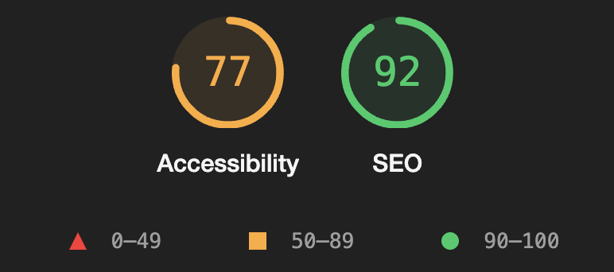

<h1 align="center">
  <strong>Pet Care</strong>
</h1>

  

<h2>Project Overview</h2>

This project aims to develop a comprehensive and responsive website for a Pet Care company, showcasing its services and commitment to pet well-being through a visually appealing and user-friendly interface. The website is meticulously crafted using the latest web technologies to ensure high performance and accessibility across various devices.

<h2>Key Features</h2>

<ol>
  <li><strong>Central GIF Animation:</strong> A captivating central GIF animation that engages visitors, showcasing the lively and caring nature of the Pet Care company's services.</li>
  <li><strong>Interactive Elements:</strong> Utilizes JavaScript to add interactivity to the website, including dynamic content loading and interactive UI components.</li>
  <li><strong>Tailwind CSS:</strong> Employs Tailwind CSS for styling, taking advantage of its utility-first approach to build custom designs quickly without leaving the HTML.</li>
  <li><strong>Accessibility and SEO:</strong> Implements best practices for accessibility (<code>Accessibility score: 77</code>) and SEO (<code>SEO score: 92</code>), ensuring the website is accessible to as wide an audience as possible and ranks well on search engines.</li>
</ol>

  

<h2>Technologies Used</h2>

<ul>
  <li><strong>HTML:</strong> For structuring the website's content.</li>
  <li><strong>Tailwind CSS:</strong> For styling and implementing responsive design.</li>
  <li><strong>JavaScript:</strong> To add interactivity and dynamic content.</li>
  <li><strong>Jest:</strong> Used as the testing environment to ensure code reliability and functionality through comprehensive unit and integration tests.</li>
  <li><strong>Playwright:</strong> For End-to-End (E2E) testing, verifying the website's functionality across different browsers and environments.</li>
</ul>

<h2>Setup and Usage</h2>

Follow these steps to get the project up and running on your local machine:

<ol>
  <li><strong>Clone the Repository:</strong> Use the command <code>git clone https://github.com/Alexandru-Bulai/website-project.git</code> to clone the project repository.</li>
  <li><strong>Navigate to the Project Directory:</strong> Enter the project directory by running <code>cd website-project</code> in your terminal.</li>
  <li><strong>Install Dependencies:</strong> Run <code>npm install</code> to install all required modules and dependencies for the project.</li>
  <li><strong>Start Development Environment:</strong> Execute <code>npm run dev</code> to launch the development environment and auto-run tests.</li>
  <li><strong>Access the Website:</strong> Open your web browser and visit <code>http://localhost:8081/home.html</code> to view the website.</li>
</ol>

Enjoy exploring and editing the website as needed!

<h2>Testing Environment</h2>

The project incorporates a robust testing setup:

<ul>
  <li><strong>Unit and Integration Testing:</strong> Located in the Test folder, allowing for the addition of more JavaScript tests to ensure functionality.</li>
  <li><strong>Troubleshooting Guide:</strong> For any issues, refer to our guide on YouTube (<code>https://www.youtube.com/watch?v=FgnxcUQ5vho&t=192s</code>).</li>
</ul>

<h2>E2E Testing with Playwright</h2>

For comprehensive E2E testing, we utilize Playwright:

<ul>
  <li><strong>Local Testing:</strong> Run <code>npm run e2e-local</code> for local testing with an HTML report.</li>
  <li><strong>CI Testing:</strong> Use <code>npm run e2e</code> for testing in Continuous Integration environments or when a visual report is not needed.</li>
  <li><strong>Playwright UI:</strong> For specific test selection or visual debugging, execute <code>npx playwright test --ui</code>.</li>
</ul>

<h3>E2E Testing</h3>

We are using Playwright to perform some End 2 End Testing.
Run <code>npm run e2e-local</code> to perform all checks locally and see an HTML report.
Run <code>npm run e2e</code> in your CI or if don't need a visual report produced.
For picking certain tests, visual debugging etc you can run <code>npx playwright test --ui</code>.
